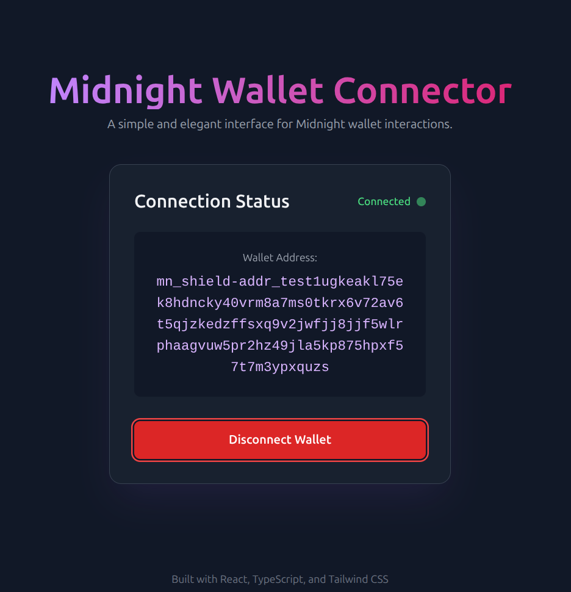

# React Midnight Wallet Connector

[](https://shields.io/)
[](https://shields.io/)

A small React app that demonstrates how to connect a web app to the Midnight Network Wallet via dApp connector API and browser wallet extensions (for example, Lace). Use this as a reference implementation for connecting and interacting with [Midnight dApp Connector APIs](https://docs.midnight.network/develop/reference/midnight-api/dapp-connector).

## Overview

This app provides a reference implementation for connecting React applications to the Midnight Network through browser wallet extensions like Lace.

## Features

- 🔌 Connect/Disconnect to Midnight Network Lace wallet
- 👛 Display wallet address



## Prerequisites

- **Node.js**: v18 or higher
- **npm** or **yarn** package manager 
- [Midnight Lace wallet extension](https://chromewebstore.google.com/detail/lace-beta/hgeekaiplokcnmakghbdfbgnlfheichg) installed in your browser

## Tutorial

If you are a developer familiar with React but new to Midnight, you can refer to the [TUTORIAL](TUTORIAL.md) which will guide you through the basic steps to create a React application that connects to a wallet using the Midnight DApp Connector API.

After using this tutorial and example app, you should:
- Understand basic Midnight wallet connection flow
- Know how to use @midnight-ntwrk/dapp-connector-api
- Have working starter code to build your own applications

## Installation

```bash
# Install dependencies
npm install

# Or using yarn
yarn install
```

## Development

```bash
# Start development server
npm run dev

# Or using yarn
yarn dev
```

The app will be available at `http://localhost:5173`

## Project Structure

```
react-wallet-connector/
├── src/               # Source code
│   └── components/    # React components
├── public/           # Static assets
└── package.json      # Project configuration
```

## Useful Links

- [Midnight Network Documentation](https://docs.midnight.network)
- [Lace Wallet Documentation](https://docs.midnight.network/getting-started/installation#install-the-lace-midnight-preview-wallet)
- [React Documentation](https://react.dev)
